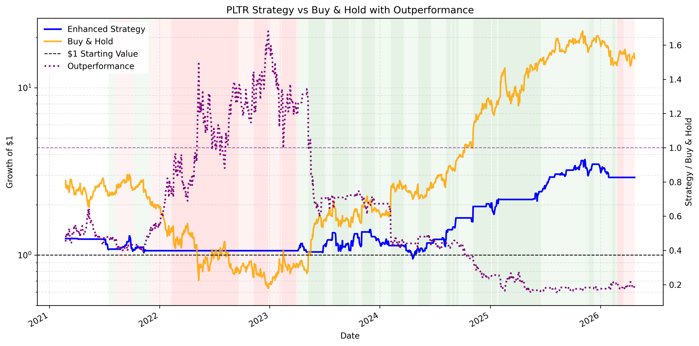
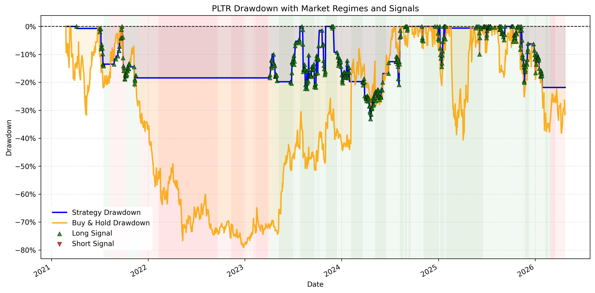
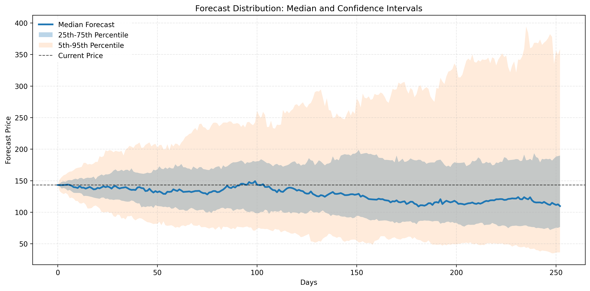

# 📊 PLTR Equity Research Pipeline


> Institutional-style equity research and quantitative risk pipeline for Palantir (PLTR)

---

## 📌 Overview

This project automates a full equity research workflow:

**data → modeling → risk analysis → forecasting → visualization → PDF report**

It evaluates PLTR as a **probabilistic, regime-dependent asset** with asymmetric upside and meaningful downside risk.

### Core Capabilities

- Strategy backtesting using EMA, RSI, and volatility filters
- Risk and tail-risk modeling, including VaR and Expected Shortfall
- Multi-factor regression across market, size, value, momentum, and defense factors
- Regime detection across bull/bear and volatility environments
- Peer and benchmark comparison
- Monte Carlo simulation and GARCH volatility forecasting
- Automated chart generation
- Automated PDF report generation

---

## 💡 Why This Project Matters

Most equity research focuses on narratives and point estimates.

This project treats PLTR as a **distribution of outcomes**.

### From Opinion → Systematic Analysis

- Repeatable models
- Statistical validation
- Risk-adjusted evaluation

### Risk-First Framework

- Drawdowns, VaR, and Expected Shortfall
- Volatility clustering through GARCH modeling
- Regime-dependent performance analysis

### Probabilistic Thinking

- 5th / 50th / 95th percentile outcomes
- Scenario-based forecasting
- Fat-tailed return distributions

---

## 🚀 Quick Start

```bash
pip install -r requirements.txt
python main.py
```

### Outputs

```text
outputs/charts/
outputs/tables/
outputs/pltr_equity_research_report.pdf
```

---

## 📊 Key Visual Outputs

### Strategy vs Buy & Hold



### Drawdown with Regimes



### Forecast Confidence Bands



---

## 🔁 Workflow

1. Data ingestion
2. Feature engineering
3. Signal generation
4. Backtesting
5. Risk modeling
6. Statistical testing
7. Regime detection
8. Factor modeling
9. Forecasting
10. Visualization
11. Automated PDF report generation

---

## 📈 Example Results

| Metric | Value |
|---|---:|
| Buy & Hold Return | ~1406% |
| Strategy Return | ~191% |
| Strategy Max Drawdown | ~-33% |
| Buy & Hold Max Drawdown | ~-79% |
| VaR (95%) | ~-6% |
| Expected Shortfall (95%) | ~-8% |

---

## 🧩 Key Findings

- PLTR is a **high-volatility, regime-driven asset**
- Buy & Hold maximizes return but introduces extreme drawdowns
- The strategy reduces drawdown but sacrifices upside
- Tail risk is **clustered, not constant**
- Forecast outcomes are **highly dispersed**
- The strategy is best interpreted as a **risk-transformation overlay**, not a persistent alpha generator

---

## 🎯 Recruiting Alignment

### Quant Finance

- Monte Carlo simulation
- GARCH volatility modeling
- Multi-factor regression
- Risk and tail-risk analytics
- Statistical testing and performance attribution

### Engineering

- Modular Python architecture
- Automated reporting pipeline
- Reproducible workflows
- Clean output management for charts, tables, and reports

---

## 📁 Project Structure

```text
src/        → Core modeling and analytics modules
config/     → Strategy and pipeline parameters
data/       → Raw and processed data
outputs/    → Charts, tables, and final report
main.py     → Pipeline execution
README.md   → Project documentation
```

---

## 🧠 Final Takeaway

PLTR behaves as a **high-risk, convex growth asset**.

This project demonstrates how to move from:

> **opinion → data → insight → decision**

And more importantly:

> For high-volatility assets, **the distribution of outcomes matters as much as the expected return**.
